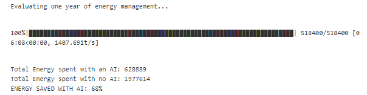

# Minimize-Energy-consumption-with-Deep-Learning-model
Use Deep Q-Learning model to optimize energy consumption of a data center

This project leverages an AI deep learning model to optimize and reduce by up to 70% the energy consumption of a data center.
The AI model uses Q-Learning algorithm to determine the best action at every time step.
Q-Learning is based on Bellman equation.

# Description
The project aims to reduce energy consumption of an industrial installation. A deep learning optimization model is used and compared with the traditional integrated cooling system. The approach is inspired by the 40% reduction achieved at Google's data centers using DeepMind AI model.

In this scenario, there are two key assumptions:
- The intrinsic temperature of a server is a function of the atmospheric temperature, the number of users on the server and the data transmission rate. The relationship is approximated by a linear combination of those 3 variables. Coefficients are estimated using regression analysis.
- The energy spent to regulate temperature between to time steps by either an AI system or the traditional integrated cooling system is proportional to the absolute change in temperature. Using this linear relationship, we can estimate the energy consumption from each mechanisms as proprotional to the absolute temperature change of the server.

# Q-Learning
Q-Learning is a reinforcement learning algorithm to learn quality of actions telling an agent what action to take under what circumstances. It determines the value of all possible actions given a certain state (or circumstances). It does not require a model of the environment as it learns the environment exploring it. The values of actions (or Quality of actions) are determined recursively as the algorithm explores the environment and learns from the obtained results over a high number of iterations. Q-learning finds an optimal policy (sequence of actions) in the sense of maximizing the expected value of the total reward over any and all successive steps, starting from the current state. In other words, Q-learning can identify an optimal action-selection policy for any given finite Markov decision process (Markov decision process = the outcome does not depends on the past but solely on the future actions at any given point), given infinite exploration time and a partly-random policy.  

Reminder (wikipedia): Reinforcement learning involves an agent, a set of states S, and a set A of actions per state. By performing an action a in A, the agent transitions from state to state. Executing an action in a specific state provides the agent with a reward (a numerical score). The goal of the agent is to maximize its total reward. It does this by adding the maximum reward attainable from future states to the reward for achieving its current state, effectively influencing the current action by the potential future reward. This potential reward is a weighted sum of the expected values of the rewards of all future steps starting from the current state.

The reward is defined as the absolute difference between the energy required by the cooling system vs the energy required by the AI model. This is the energy saved by AI.

# Deep Learning model

The project uses a simple neural network made of 3 fully connected layers.
The network takes as input a normalized vector representing the state. In this problem, the state is represented by the server temperature, the number of users and the data transmission rate. The 2 hidden layers have 64 and 32 nodes respectively. The output layer predicts the Q-values amongst 5 potential actions. A softmax activation function generates a probability distribution which allows to identify the action with the highest Q-value.
The learning phase uses "Experience Replay" technique to train. 

# Results

